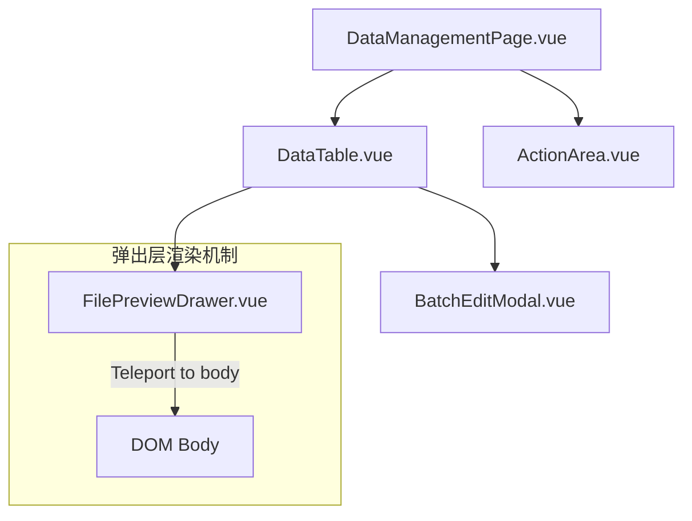

# 前端组件关系说明文档

## 1. 弹出组件识别
用户在文件列表中点击文件名后，弹出的侧边栏组件是：
**`frontend/components/FilePreviewDrawer.vue`**

### 页面层次结构


## 2. 组件职能说明

| 组件名称 | 路径 | 核心职责 |
| :--- | :--- | :--- |
| **DataManagementPage** | `frontend/pages/DataManagementPage.vue` | 数据管理模块的父级页面。 |
| **DataTable** | `frontend/components/DataTable.vue` | 提供数据展示列表，持有 `isDrawerOpen` 状态来控制预览。 |
| **FilePreviewDrawer** | `frontend/components/FilePreviewDrawer.vue` | **[目标弹出组件]** 负责文件的解压、预览和全文搜索。 |
| **ActionArea** | `frontend/components/ActionArea.vue` | 负责顶部统计信息、常用操作按钮及文件上传。 |

## 3. 核心交互流程

1. **点击文件名**:
   用户在 `DataTable.vue` 中点击文件名，由 `viewFile` 函数处理：
   ```typescript
   // DataTable.vue 逻辑节选
   const viewFile = (id: string, event?: Event) => {
       previewFileId.value = id;
       isDrawerOpen.value = true;
   };
   ```

2. **预览抽屉弹出**:
   `FilePreviewDrawer` 使用 `<Teleport to="body">` 将渲染位置转移到 body，确保其浮动在所有 UI 元素之上。

3. **数据预览策略**:
   由于传感器数据文件往往非常庞大（如几百MB），`FilePreviewDrawer` 默认采用 **Preview Mode**（只加载前几块数据块进行解析渲染），以保证极速响应。用户如果需要查看全量数据，可以点击按钮在主页面中全量打开。
